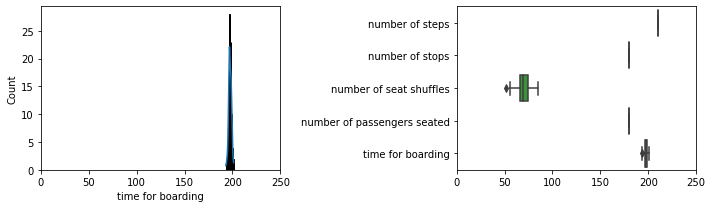
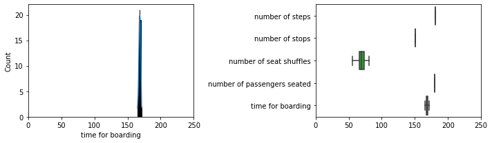
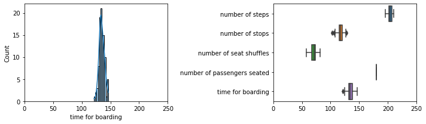
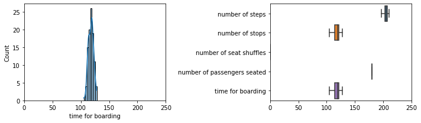
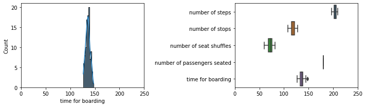
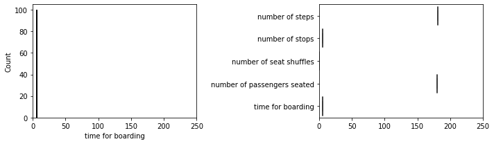

# Boarding time simulator

This is a short boarding time simulator inspired by CGP Greys video on [better boarding methods](https://www.youtube.com/watch?v=oAHbLRjF0vo).

## Installation & Usage

Python 3.x should include all the packages required for the boarding time simulator but see the dependencies for visualization tools. To run a simulations, execute

```python
from airplane import Airplane
from simulation import Simulation
from queues import FrontToBack

airplane = Airplane(number_of_rows=30, seats_per_row=6)
sim = Simulation(airplane, FrontToBack, max_iter=1000)

sim.run()
```

`sim.run()` returns a dictionary with the number of simulation steps, number of stops (i.e. when a passengers sits down), number of seat shuffles, and passengers seated. I decided to calculate the time for boarding as `time_for_boarding = results['number of stops']*TIME_PER_STOP + results['number of seat shuffles']*TIME_PER_SHUFFLE` with 1 minute for each stop and an additional 0.25 minutes when seat shuffles are required.


#### Dependencies

For visualization I used the following packages.

- matplotlib
- pandas
- seaborn

## Results

In `èxample_simulations.ipynb` I collated example simulations for the boarding methods discussed in CGP Grey's video: front-to-back, back-to-front, random, window-middle-aisle, modified Steffen, and perfect Steffen.

For the examples here I used a single-aisle plain with 30 rows and 6 seats per row (window-middle-aisle on either side). I did not include a first-class in the plane for simplicity. Each simulation is run 100 times and the results are plotted using 

#### Front-to-Back

In Front-to-Back the passengers start boarding the plane with the first row and fill towards the back. Front-to-Back is probably the worst boarding method because it prevents parallel seating because only the person at the front of the line has reached their seat at any given point. In this example, there is on boarding group per row. Each row boards in order but passengers within each row are randomized.



#### Back-to-Front

Back-to-Front is the opposite of Front-to-Back. The last row starts boarding and the plane is filed according to decreasing rows. As with Front-to-Back, rows board in order but passengers are randomized within each row.



#### Random

For random seating all passengers are randomized and there are no boarding groups.



#### Window-Middle-Aisle

In Window-Middle-Aisle passengers are organized into 6 boarding groups starting with window-seats on either side, then middle-seats on both side, and lastly aisle-seats on both sides. Within each group, passegers are randomized so there is no order in terms of the row number but seat-shuffles are eliminated.



#### Steffen (modified)

Steffen is an idealized boarding approach that is theoretically most efficient (see Steffen perfect). However, to adapt the Steffen method to real-world boarding passengers are sorted into 4 boarding groups: Alternating rows on alternating sides. Within each group, passengers are again randomized.



#### Steffen (perfect)

As mentioend above, Steffen is an ideal boarding method that is theoretically most efficient. Passengers are perfectly ordered both back-to-front and window-middle-aisle. In the method mentioned by CGP Grey, each group is separated into alternating rows (e.g. first odd, then even rows) resulting in 12 boarding groups. However, I decided to omit the even-odd split to simplify the simulation steps resulting in 6 boarding groups (same as in Window-Middle_Aisle but ordered from back to front).




